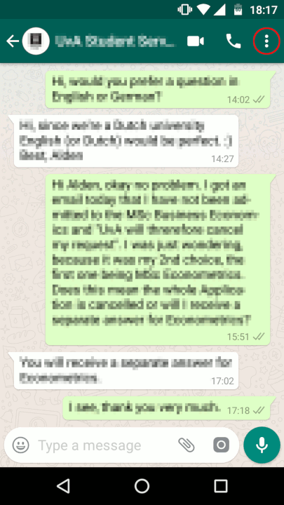

   

 

# WhatsStat

 

**A Python application that analyzes your exported WhatsApp chats using Qt for the GUI**
  

  
[Features](README.md#Features) •
[Preparations](README.md#Preparations) •
[Usage](README.md#Usage)
 

## Features

 The application takes the exported .txt chat-file as input _(currently only English/German supported)_.  
The messages then get analyzed, prepared and the application finally generates an image containing:
 

- A wordcloud with the 500 most used words
- A bar chart showing the total number of messages during each day of the week
- A line chart showing the busiest times in a 24h timespan

 

_Sample output with the default wordcloud form_

 

 

### Use a custom image for the generated wordcloud

Custom pictures can be selected to act as a mask for the resulting wordcloud.  
The picture has to be square with a white background:
  

_Custom picture with resulting wordcloud_

 

### Exclude common words like _"You, I, and… etc."_

Common words like articles and connectives can be excluded from the wordcloud:
  

_Common words included/excluded_

 

## Preparations

First you need to export a chat history using WhatsApp's _Export chat_ feature:
 

_Exporting a WhatsApp chat (Android)_

 
This will generate a .txt file containing the chat history. Copy this file anywhere
on your computer and select it in the WhatsStat application.

 

## Usage

1. Download the repository
2. Make sure the requirements are met on your machine
3. Navigate to **src/main/python** and run `$ python main.py`
